[Link gốc](https://www.youtube.com/watch?v=Bd67eKmOzJU&t=2s)

> Tất cả bài viết sử dụng win 10
> Chủ đề :Non-Malicious Activity
# Part 4 01.pcap
Tác giả cũng không nói gì nhiều chỉ nói về một alert đang ngờ , xong sau đó dùng filter đã lưu trước đó `ttp.request or tls.handshake.type eq 1) and !(ssdp)` rồi tìm vào Port 55358 rồi xem TCP Stream, chủ yếu có thể nghe youtube hoặc đọc slide để dể hiểu hơn.
# Part 4 02.pcap
# Part 4 03.pcap
Đến bài này chúng ta sẽ phân tích gói tin đầu tiền bằng filter basic và TCP stream
Tác giả giới thiệu về Host : `store-images.s-microsoft.com` 
Trong TCP ta sẽ thấy được content là image/jpeg
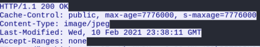

Và như chúng ta có thể thấy, không xuất hiện dòng `User-agent`
Tiếp theo tác giả dùng `Export` và `HTTP` để lưu lệnh HTTP đầu tiên dưới dạng jpg, đây là kết quả của ảnh temp1.jpg đã được tải xuống từ Host : `store-images.s-microsoft.com` , microsoft store

Theo như silde thì khi cắm  1 thiết bị usb, sẽ tạo lưu lượng đến `go.microsoft.com` và `dmd.metaservices.microsoft.com`, traffic này chứa metadata về các thiết bị nên tác giả đã ignore đi vì gửi đi bằng http không mã hóa 
# Part 4 04.pcap
Như đã nói từ trước , ở phần này ta thấy 2 http request như trong ảnh, tác giả nói rằng 2 gói tin này đi đôi với nhau
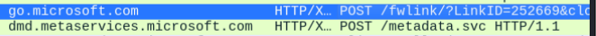

Sau đó follow tcp stream ta được ảnh dưới , qua phân tích thì thấy máy client sẽ gửi metadata khi 1 thiết bị usb cắm vào win 10 :
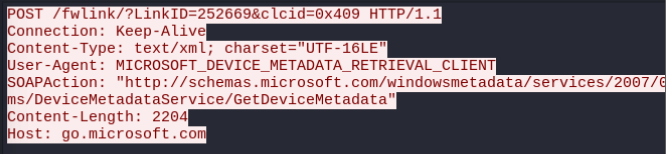

Mỗi lệnh htpp `go.microsoft.com` đều tạo ra thêm 1 request nữa `dmd.metaservices.microsoft.com`:
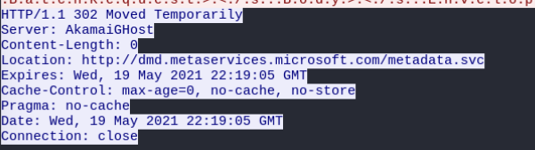

Tiếp theo quay trở về filter cũ và follow tcp stream của request nữa `dmd.metaservices.microsoft.com` ta được ảnh dưới, tín hiệu trả về 200 OK và thêm dữ liệu xml được format:
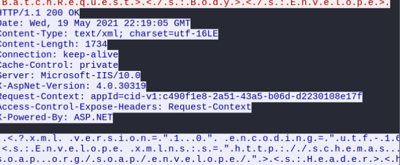

# Part 4 05.pcap
Tiếp theo tác giả giời thiệu Swarm là 1 giao thức phân phối window update từ các máy tính khác.Sử dụng port 7680 để chuyển lưu lượng giữa các window clients ở trong cùng mạng LAN.
Sử dụng filter `(http.request or tls.handshake.type eq 1 or tcp.flags eq 0x0002) and !(ssdp)` -> lưu thành filter mẫu `basic+`
Ở trong ảnh dưới ta thấy có 2 packet [SYN] bắt đầu cho 2 luồng TCP đều gửi đến 2 port 7680:
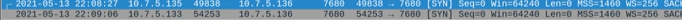

Follow TCP stream vào địa chỉ ip `10.7.5.135`, không có nhiều thông tin ở đây, chỉ thấy có Swarm protocol xuất hiện ở cả bên gửi và bên nhận: 
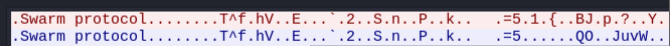

Các kênh tcp này sẽ hoạt động vô thời hạn được sử dụng để gửi dữ liệu hoặc cập nhật các ứng dụng
---
# Lưu lượng tạo ra bởi các web browser
## Part 4 06.pcap
Dùng filter `dns.qry.name contains ".localdomain"` ta được như ảnh dưới : 
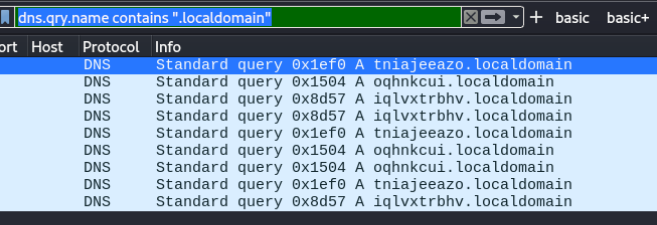

Khi ta dùng filter `nbsn` thì sẽ thấy được 3 chuỗi random sting in hoa giống với filter trên:
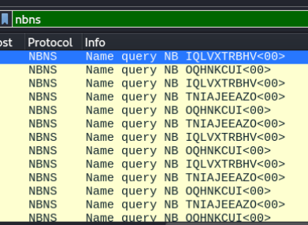

Nguyên nhân là do nếu nếu dns query không được phân giải hoặc không nhận được phản hồi từ dns server thì window sẽ thử queery truy vấn ở trên nbns. Nói ngắn gọn thì Chomre và Edge sẽ gửi DNS truy vấn ngẫu nhiên các doamin không tồn tại. Đảm bảo rằng các ISPs sẽ không chyển hướng lưu lượng sang các traffic khoog tồn tại. Nếu được phản hồi thì sẽ là NXDOMAIN
Quay lại với filter `basic` , lướt xuống dưới ta thấy có số request liên quan đến domain `.gvt1.com`, đó là domain của google để gửi các bản updates cho chrome và edges:
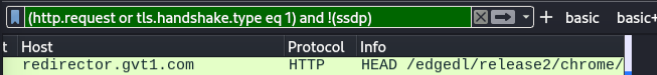

## Part 4 07.pcap
Tương tự chỉ chứng minh edge cũng giống như chorme, tác giả đã băm nhỏ pcap ra vì update của egde , chorme sẽ rất lớn.
## Part 4 08.pcap
Tác giả nói qua về DNS over HTTPS(DoH)
Truy vấn DNS được đóng gói thành một request HTTPS.
Gửi qua cổng 443 như lưu lượng web thông thường.
Do đó:
    Nội dung DNS query được mã hóa bằng TLS (không bị sniff dễ dàng).
    Khó phân biệt với traffic web thông thường → vượt qua chặn dựa trên port.
Thông thường cơ chế này bị tắt ở doanh nghiệp.
## Part 4 09.pcap
Dùng filter `(http.request or tls.handshake.type eq 1 or tcp.flags eq 0x0002) and !(ssdp) or dns` để lọc thì thấy:
    Chỉ có 2 DNS request đầu tiên tới các domain của firefox, trong đó có cloudflare , đó là mặc định của firefox khi truy cập DoH, sau đó không thấy DNS request nào nữa.
    Nhưng ta thấ 1 số HTTPS request liên quan đến cloudflare và 1 số domain khác như hình dưới, đó chính là ví dụ DNS qua tunnel của HTTPS:
    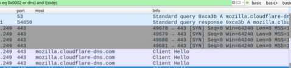
    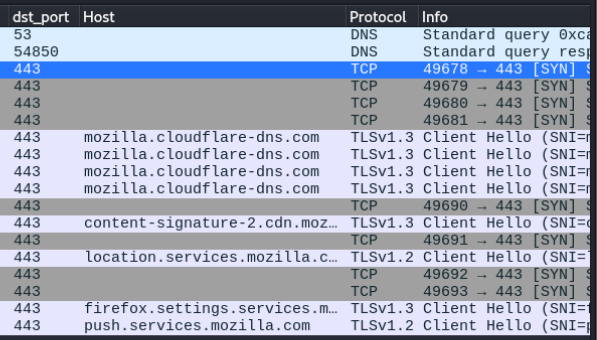
## Part 4 10.pcap
Các ứng dụng ở window sẽ định kỳ check updates, sau đây tác giả sẽ giới thiệu các file pcap liên quan đến update của adobe reader.
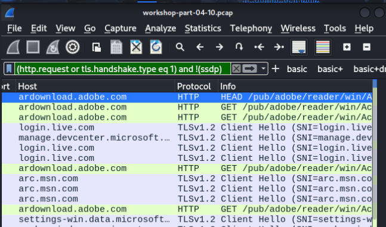

## Part 4 11.pcap
### IRC Traffic
Ta sẽ follow tcp stream của cuối port 6667 với dst ip là: 143.244.34.1, với bài này irc không được mã hóa tin nhắn , sẽ được hiển thị dưới bản raw
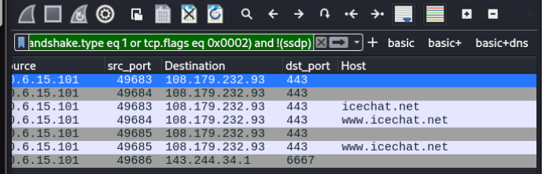

Có thể xem bằng cách filter `irc`, thông thường sẽ được mã hóa. Tác giả có nói dạo gần đây thường không gặp irc through C2 command của malware khi reseach.

## Part 4 12.pcap
### FTP Traffic
Tác giả sử dụng FileZilla để lấy được linecse từ ftp.adobe.com
Sử dụng filter `basic+ dns ` để ta thấy được DNS request, sau đó ta thấy
    Traffic đến port 21 chính là FTP control channel
    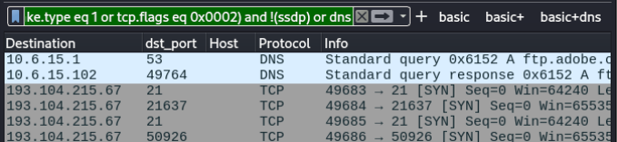
    Traffice đến port 21637 và 50926  là FTP data channel

Sau đó follow TCP stream của gói tin SYN đầu tiên sẽ thấy các câu lệnh không mã hóa của FTP
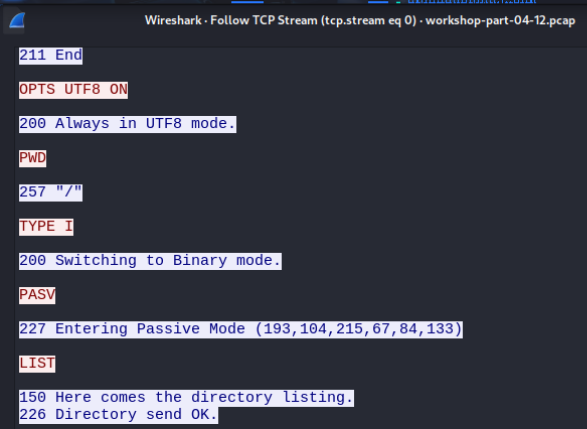

Follow TCP stream của gói tin ngay sau gói tin SYN (ở port 21637) ta sẽ thấy đươc list của FTP, có thể là respone của lệnh List trong gói tin SYN
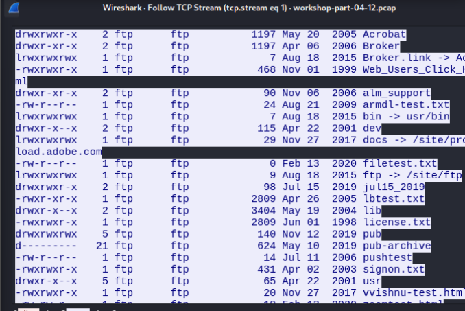 

Follow TCP stream của gói tin SYN thứ 2 thì ta sẽ chú ý đến lệnh truy xuất ` RETR license.txt`
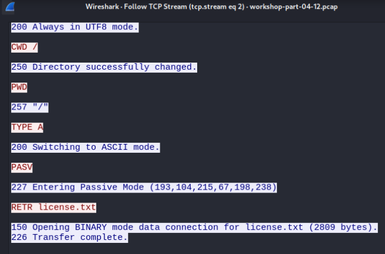

Cuối cùng là Follow TCP stream của gói tin SYN cuối cùng của filter thì sẽ thấy FTP data channel show nội dung của license.txt
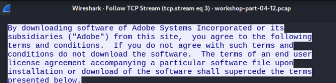

Sử dụng filter như trong ảnh để đọc được các request và phản hồi của ftp:
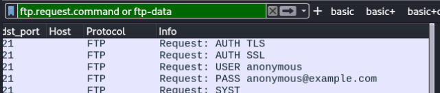

## Part 4 13.pcap
### Email Traffic
Tác giả có nói là nếu 1 email mà đi là IP ngoài mà phân giải đến 1 server mail không thông dụng thì có thể là các hoạt động độc hại

Ở file pcap này , tác giả vẫn dùng filter  `basic+ dns ` để thấy đưuọc các dns request được mã hóa thông qua 2 kênh port 993 và 465 là imap và smtp , nội dung data cũng sẽ được mã hóa thông qua các luồng tcp
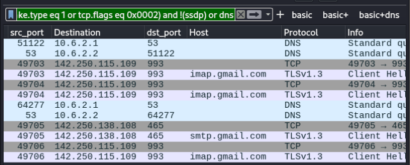

Có thể dùng filter `imap, smtp, pop` nhưng sẽ không thấy kết quả 
## Part 4 14.pcap
### Email Traffic
Đến file này thì dùng mail của outlook nên khi nhìn ảnh sẽ thấy có ít thông tin vì tcp đi qua port 443 HTTPS
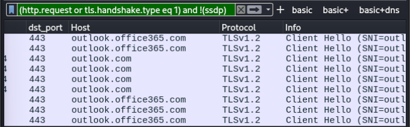

Sẽ không thấy thông tin cụ thể nào liên quan đến email giống như file pcap lần trước, chỉ có outlook domain
Có thể dùng filter `imap, smtp, pop` nhưng sẽ không thấy kết quả 

## Part 4 15.pcap
### Email Traffic
Tác giả dùng Thunderbird email client, được setup là không bảo mật
Ta thấy có DNS request và có lưu lượng mạng của smtp và pop thông qua TCP đến các port 587 và 110
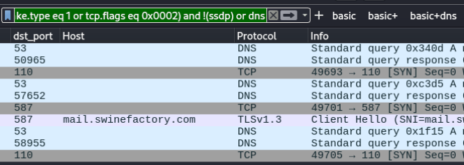

Sau đó ta filer `smtp` thì thấy 1 số commnad trước khi thiết lập mã hóa tls
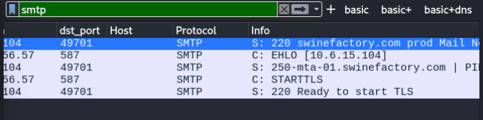

Khi ta follow tcp stream của gói tin đầu thì thấy bị mã hóa
Nhưng khi filter `pop` thì nhìn vào cột Info sẽ thấy được nội dung không mã hóa

Tiếp theo là ta dùng filter `tcp.port eq 110 and tcp.flags eq 0x0002` rồi dùng follow tcp stream gói tin đầu tiên ta thấy được nội dùng không mã hóa
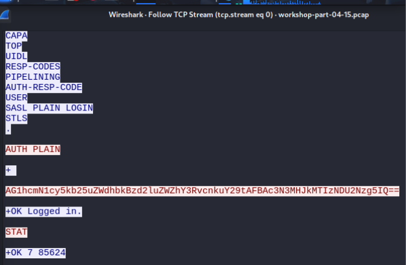

Ta thấy 1 dãy kí tự được mã hóa Base64, sau đó ta giải mã được như ảnh:
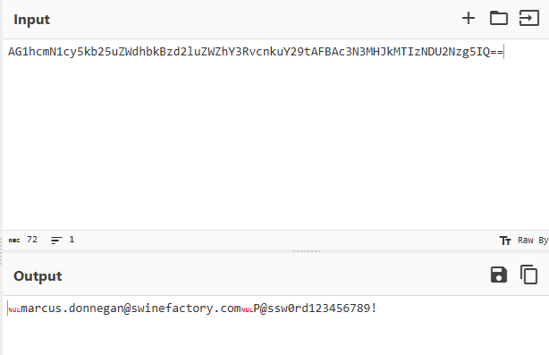
Ta lướt xuống có rất nhiều thông tin, có cả raw cảu nội dung tin nhắn mail, thấy số lượng tin nhắn

Tiếp theo làm tương tự với packet thứ 2
## Part 4 15+16.pcap
### File transfer over SMB
Export -> SMB ->file /2021-calendar-blank.xlsx
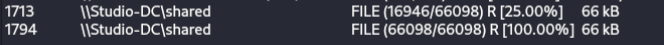
Lấy file 100%

## Part 4 17.pcap
### TOr traffic
Ở đây tác giả nói wireshark phân tích TCP port 8080 thành HTTP thay vì HTTPS , vì vậy cần set lại tcp 8080 thành tls 
`Analyze -> Decode as`, nếu save thì phải xóa đi để xem được dữ liệu không mã hóa của http
Tor traffice có dùng bất cứ tcp port .
Wireshark khi hiển thị packet không chỉ dựa vào payload, mà còn dựa nhiều vào port number mặc định để đoán giao thức.
Nhưng trong thực tế, nhiều ứng dụng không dùng port chuẩn, mà dùng port khác để che giấu hoặc do cấu hình riêng.

👉 Trong lab của bạn: Tor đang dùng TCP port 8080 nhưng thực ra là TLS traffic.

Wireshark thấy port 8080 → mặc định gán là HTTP.

Nhưng nếu bạn "Decode As → TLS" thì Wireshark sẽ phân tích đúng bản chất.