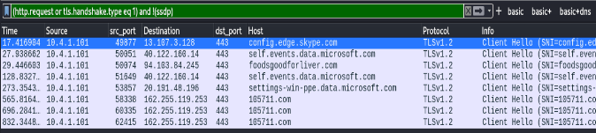
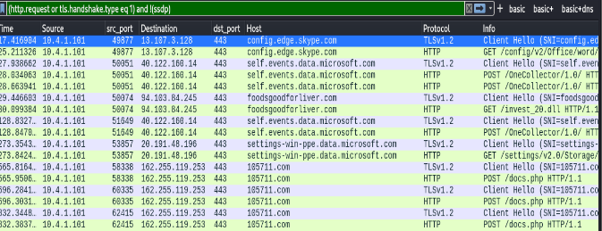
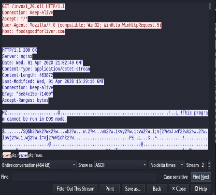
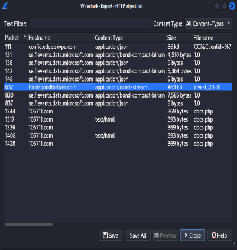
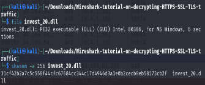
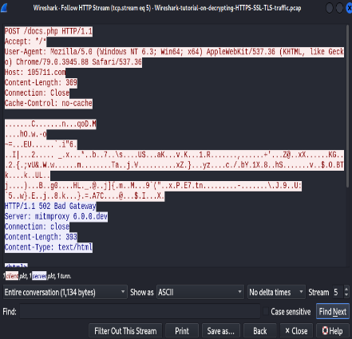

[Link gốc](https://unit42.paloaltonetworks.com/wireshark-tutorial-decrypting-https-traffic/)

# HTTPS Traffic Without the Key Log File
Mở đầu cho bài này được lấy dữ liệu traffic của Dridex malware

Có 2 file : file .pcap và file key dạng .txt

Dùng filter `basic` đầu tiên để xem, không có key log file thì chỉ có thể xem được các dữ liệu cơ bản như : địa chỉ ip, port tcp, và domain name

Tiếp theo là đến chọn `Edit -> Preferences -> Protocols -> TLS`. Bạn sẽ thấy dòng `(Pre)-Master-Secret log filename.`. Click vào đó vào chọn file key log .txt vừa unzip `Wireshark-tutorial-KeysLogFile.txt` xong bấm `Apply -> OK`

# HTTPS Traffic With the Key Log File
Sau khi xong thì wireshark sẽ hiện ra các decrypted HTTP request dưới vỏ của HTTPS

Ở đây có có thể thấy được các HTTP request của `microsoft.com and skype.com` được giấu bên trong các HTTPS traffic. Chúng ta đồng thời cũng thấy vấn đề chính là các traffic của malware bao gồm:
- foodsgoodforliver[.]com - GET /invest_20.dll
- 105711[.]com - POST /docs.php

Request `GET` đến foodsgoodforliver[.]com được trả về 1 file .dll cho Dridex malware. Request `POST` là C2 traffic từ máy chủ Window bị nhiệm độc.

Tiếp theo là `Follow HTTP stream` của `GET` request đến foodsgoodforliver[.]com. Cơ bản sẽ thấy được server trả về 1 exe/dll.

Vì đã có key log nên ta có thể trích xuất malware từ file pcap. Dùng `File --> Export Objects --> HTTP`. Mở terminal và thực hiện 2 lệnh để xem thông số cơ bản `file` và `shasum -a 256` 

Mã hash SHA256  của malware này là `31cf42b2a7c5c558f44cfc67684cc344c17d4946d3a1e0b2cecb8eb58173cb2f`. Nếu bạn tìm trên mạng sẽ thấy vài môi trường sandbox.

Tiếp theo là `Follow HTTP stream` của `POST` request đến `105711[.]com`

Ơ đã kết thúc rồi sao, dù sao thì cảm ơn mọi người đã đọc

