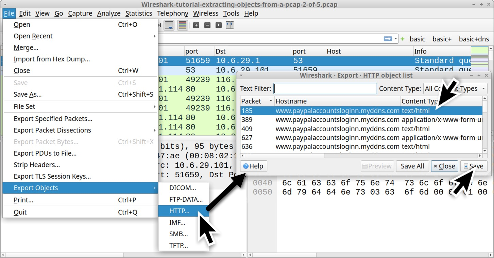
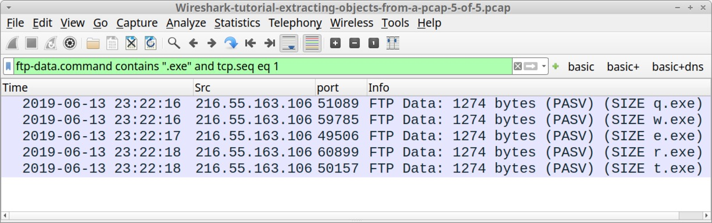

# Exporting Objects From a Pcap
[Link gốc](https://unit42.paloaltonetworks.com/using-wireshark-exporting-objects-from-a-pcap/)
Nghe có vẻ dễ, nhưng mình vẫn sẽ làm vì nó để lại rất nhiều kinh nghiệm cho người mới bắt đầu.

# Exporting Files From HTTP Traffic
Mở file pcap no 1 lên rồi dùng filter `http.request`


Khi phân tích ảnh trên , ta thấy có 3 request `GET`, ta sẽ tập trung vào 2 request cuối đến `smart-fax.com`. Request đầu tiên đến 1 file `.doc`, cái thứ 2 sẽ request đến 1 file `.exe`.
```
smart-fax[.]com - GET /Documents/Invoice&MSO-Request.doc
smart-fax[.]com - GET /knr.exe
```
Nhắc lại bài cũ, ta sẽ export bằng cách
`File → Export Objects → HTTP...`

Sau đó tải 2 file về.


Cột `Content Type` từ HTTP object được show ra là những gì  serer định đanh file bên trong HTTP reponse headers. Trong 1 số trường hợp malware server có thể chủ động thay đỗi lab Windows malware thành 1 loại khác để tránh bị phát hiện. Nhưng ở ví dụ này thì là 1 loại đơn giản.
Ở terminal ta sẽ dùng 2 câu lệnh 

    - file [filename]
    - shasum -a 256 [filename]


---
Tiếp theo là đến file pcap no 2
Tác giả có giới thiệu đây là traffice của 1 số đã login vào trang PayPal fake login page.
Khi xem xét các traffice mạng của 1 web phishing, thì ta có thể xem giao diện như nào bằng cách `Export HTTP object` và tải file `html` về rồi xem file ở trên browser 



Nếu bạn trích xuất lấy file HTML code độc hại từ pcap và xem ở trên browser thì có khả năng sẽ gọi đến liên kết domain, vì vậy nên phải dùng đến môi trường cách ly.
---
# Exporting Files from SMB Traffic
1 số malware dùng giao thức `SMB` để lây nhiễm thông qua AD trong  cùng 1 mạng. 
malware lần này là Trickbot infection traffic.
Mở file pcap no 3.
1 số thông tin của môi trường AD như sau:
    Domain: cliffstone[.]net
    Network segment: 10.6.26[.]0 through 10.6.26[.]255 (10.6.26[.]0/24)
    Domain controller IP: 10.6.26[.]6
    Domain controller hostname: CLIFFSTONE-DC
    Segment gateway: 10.6.26[.]1
    Broadcast address: 10.6.26[.]255
    Windows client: QUINN-OFFICE-PC at 10.6.26[.]110

Ở file pcap này, malawre sẽ lấy nhiễm ở máy client tại địa chỉ ip:  10.6.26[.]110 đến ip domain controller. Ta sẽ trích xuất SMB: `File → Export Objects → SMB...`


Chúng ta xem ảnh sẽ để í thấy ở ` \\10.6.26[.]6\C$` sẽ có file `.exe` 


Ở cột content Type column, chúng ta cần [100.00%] để export đúng copy của các file . Những phần nào mà không được [100.00%] thì đã bị mất data trong network traffice
---
# Exporting Emails from SMTP Traffic
1 số loại malware hiện tại sử dụng các máy window bị nhiễm thành spambot. Những máy này sẽ spam các tin nhắn hoặc email độc hại. Nếu những nội dung này được gửi đi bằng unencrypted SMTP thì ta có thể export.
Mở file pcap no 4, ở file này sẽ nói về máy Win bị nhiễm gửi sextortion spam trong 5 giây.
Dùng filter `smtp.data.fragment`


Ta export `File → Export Objects → IMF...`


Ta có thể mở để xem file:

---
# Exporting Files from FTP Traffic
Bài viết giới thiệu `.exe` được nhận từ FTP server. Traffice cũng bao gồm dữ liệu lấy cắp từ máy nạn nhân về FTP server.
Mở file pcap no 5 cuối cùng

Dùng filter `ftp.request.command or (ftp-data and tcp.seq eq 1)`

Ta có thể thấy 1 số nội dung về user, pass , .exe
    RETR q.exe
    RETR w.exe
    RETR e.exe
    RETR r.exe
    RETR t.exe
Ta có thể quan sát kĩ hơn ở phía dưới , có thể thấy có 1 số gói tin nội dung `STOR` đươc gửi request HTML based log file đến FTP server khoảng 18s/gửi.

Ta dùng lệnh để export: `File → Export Objects → FTP-DATA...`

Đây là list các file được gưi đến FTP server bao gồm thông tin bị đánh cắp.

Chúng ta hãy xem nội dung của 1 file html.


Chúng ta phải dùng cách khác để trích xuất được `.exe` 
Filter này giúp tìm thấy các dữ liệu FTP của mỗi `.exe` được trả về FTP server: `ftp-data.command contains ".exe" and tcp.seq eq 1`


Follow TCP của gói tin `q.exe`


Ta có thể đoán đây là exe/dll bằng cách chọn `Raw` trong `show data as`


Sau đó dùng lệnh `Save as...` rồi đặt tên là `q.exe` ???
```
Command: file q.exe
Result: q.exe: PE32 executable (GUI) Intel 80386, for MS Windows
Command: shasum -a 256 q.exe
Result: ca34b0926cdc3242bbfad1c4a0b42cc2750d90db9a272d92cfb6cb7034d2a3bd q.exe
```

Chúng ta có thể check file bằng Hash ở trên `VirusTotal`


