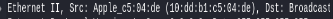
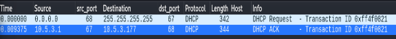
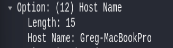
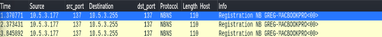
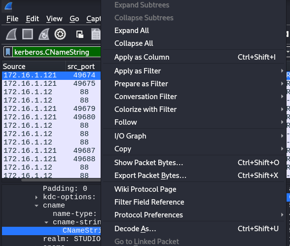
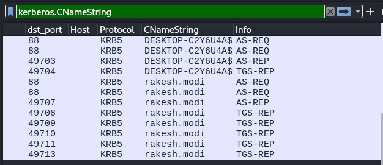
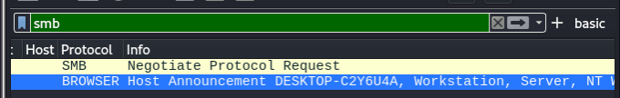

[link gốc](https://www.youtube.com/watch?v=S-ny315TOyk&t=139s)

#Part 03-01.pcap

- 3 bytes đầu của địa chỉ MAC đại diện cho các Vendor id.

- Chúng ta có thể thay đổi địa chỉ MAC thành các vendor khác nhau để có thể đánh lừa người khác.
- Tiếp theo là địa chỉ DHCP:
    - Dùng để phần cứng máy tính được câp đia chỉ ip,
    - Ban đầu địa chỉ của sourc là `0.0.0.0`, src đã gửi `dhcp request`đến địa chỉ broadcast `255.255.255.255` do cũng không biết dhcp server ở đâu. Đó gọi là DHCP discover
    
    
    -Có thể thông qua Host Name để xác nhận được thông tin cùng với địa chỉ MAC đã nói ở trên để điều tra:
    
    

- Tiếp theo là NBNS
    - Để dùng để phát hiện host-name của Window và MacOS
    - Khi nhìn vào hình dưới , ta thấy địa chỉ src vừa được cấp đã gửi gói tin broadcast đến sup-ip, và ta cũng có thể thấy thêm 1 cách nữa để thấy hostname của MacOS cũng như tương tự của window

    

- Tiếp theo là OS và Web browser
    - Malware hay 1 số tool, extension có thể thay đổi 1 số dòng thông tin (user-agent) mà ta muốn điều tra về os và browser.Trong bài này cũng chưa nhắc tới việc đó , chỉ có các thông tin thật được sinh ra chưa bị sửa đổi.
    -Cách để xem thông tin:
        1. Nhấn vào packet muốn chọn, chuột phải chọn `Follow` -> `TCP Stream`

# Workshop part 03 - 02 .pcap
# Workshop part 03 - 03.pacap
# Workshop part 03 - 04.pacap
# Workshop part 03 - 05.pacap
# Workshop part 03 - 06.pacap
...
# Workshop part 03 - 09.pacap

Các bài tiếp theo chỉ tập trung thực hành tìm các hệ điều hành OS của của máy gửi request lên, dùng filter và giả định đây là các request thật như đã nói ở trên
Tìm thông qua 2 cách :
     Ở gói tin DHCP request đầu tiên thì tìm vào host name ở dhcp , 1 số packet sẽ không có
    Cách 2 là tìm ở gói tin sau khi filter `(http.request or tls.handshake.type eq 1) and !(ssdp)` rồi tìm theo TCP tream như đã nói ở trên
Một số distro của linux sẽ không hiện thông tin OS và web browser ở dòng User-Agent.
# Workshop part 03 - 10.pacap
Ở đây tác giả tạo traffic 1 window user đăng nhập vào máy window server 2019.

Ip user: `172.16.1.121`

IP domain controller: `172.16.1.12`

Dùng filter `kerberos.CNameString` để đọc được thông tin OS, window user account name. CName đại diện cho `Client name` ở đó ta tìm `Kerberos -> as-req -> req-body -> cname -> cname-string` sẽ thấy được trên máy client

Sau khi thấy ta sẽ nhận chuột phải chọn `Apply as Column` để xem được các username khác nhau nếu có, dưới đây là hình:

Sau khi bấm vào ta sẽ được kết quả như hình, kéo xuống dưới ta sẽ thấy 1 username khác

1 Cách nữa là dùng filter `smb` để tìm host name,

Còn 1 cách nữa ,cách này thì tìm được tất cả các từ ở raw data.Dùng filter :, ví dụ `frame contains "test"`

Đến đây là kết thúc.