[Link gốc](https://www.youtube.com/watch?v=LeWKedaRFw4&t=46s)
# Mass Distribution (Comodity) Malware
Có 2 cách phổ biến phân tán mã độc window
    Phishing link
    Qua web traffic

## Malware -> Malicious HTTP Traffic
### workshop-part-05-01.pcap
Ví dụ về malware Lokibot bị nhiễm trong mạng traffic
Dùng filter `basic` thì được biết các packet có thông tin liên quan tới `fre.php` thì do malware sinh ra(domain : parisyoungerfashion).
Ta lại thấy có 2 packet HTTP tới google.com không mã hóa nên ta sẽ Follow TCP Stream
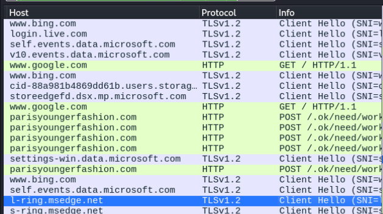

Ta thấy thông tin liên kết rất thiếu nhiều, rất ít khả năng là do các browsers sinh ra, có thể nhất là do malware sinh ra.
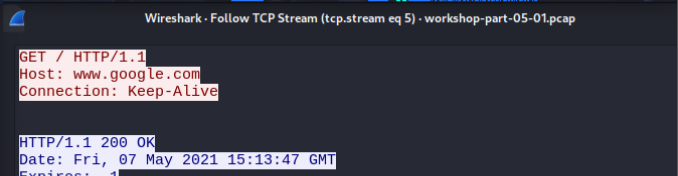

Hãy cùng Follow tcp stream ở packet tới hostdomain : parisyoungerfashion đầu tiên, ta thấy malware sinh ra thông tin rất đặc trưng , đặc biệt
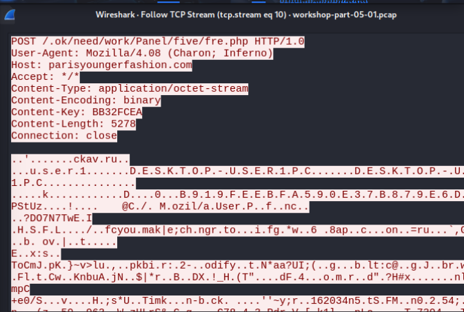

Xem ảnh đầy đủ thì có 1 số phân tích
    1 website `ckav.ru`
    window user name `user1`
    window host name `desktop-user1`
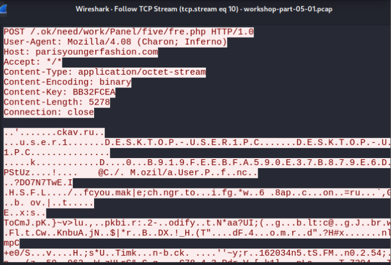
Tác giả có nói không phải lúc nào cũng có liên quan đến `fre.php`, đây là 1 host độc lập 

### workshop-part-05-02.pcap
Malware khai thác RTF được ngụy trang dưới Word bị lỗ hổng
Dùng filter `basic` , ta sẽ follow tcp với http request thứ 2
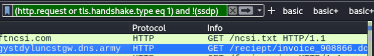

Ta thấy đây là Rich text file
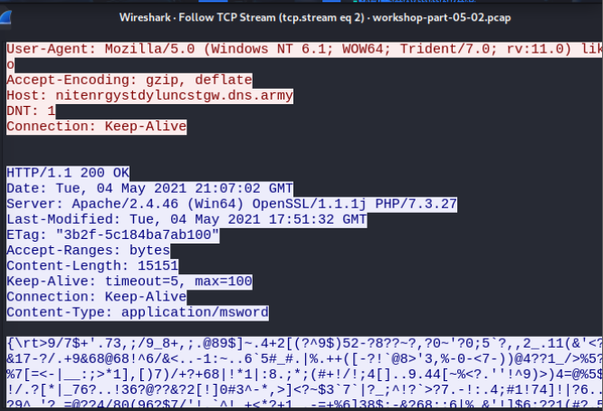

Quay lại với filter `basic`, ta thấy có 1 packet có info là exe, ta sẽ follow tcp, xem nội dung thấy đây có thể là exe
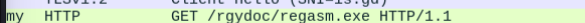

Quay lại với filter `basic`, ta chọn HTTP POST đầu tiên cho `fre.php`, ta sẽ follow tcp, ta thấy nó rất giống cấu trúc như packet của workshop-part-05-01.pcap, khác window host name
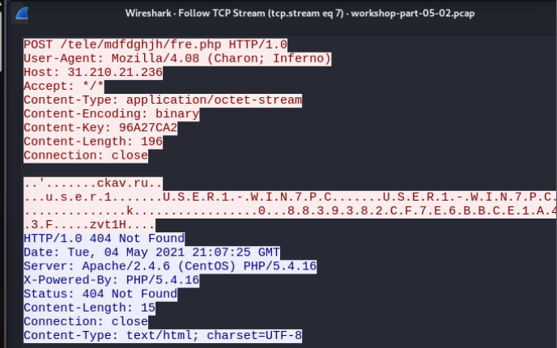

Chúng ta có thể export exe và file RTF thông qua HTTP object, sau khi đã save thì ta sẽ xem thông tin bằng lệnh `file`, ở đây thuộc tính của Word chỉ hiện là data chứ không phải RTF vì nó đã khai thác các garbage code.
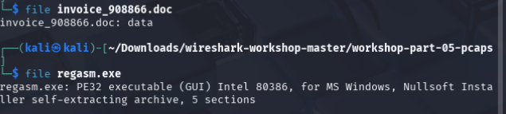

### workshop-part-05-03.pcap
Tác giả giới thiệu về phân tích traffic Formbook malware cùng phân phối theo cách với Lokibot trước đó, chúng ta sẽphân tích dữ liệu không mã hóa trong traffic
Phân tích filter `basic` thì tac giả nói các malware này sẽ có cùng 1 số mẫu nhưng sẽ khác 4 ký tự đầu ví dụ ở đây là `/e8bw/`  ở GET và POST request
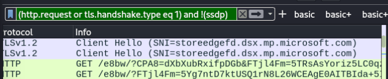

Follow Tcp ở packet GET đầu tiên, chúng ta có thể thấy header của http rất 'khiêm tốn' , là 1 bằng chứng của malware này
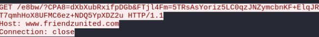

Chúng ta filter `(http.request or http.response or tls.handshake.type eq 1) and !(ssdp)` để thấy được response có cái được có cái không, chúng ta sẽ follow tcp gói trả về 200 OK, không có gì đặc biệt.
Tiếp tục ta sẽ follow tcp đến 1 gói POST ở dưới bất kì thì có phát hiện ra header nó rất ổn, OS là win 10 nhưng có điều có `rv:11.0` là internet explorer điều mà tác giả đã không mở khi tạo ra traffic này, đoạn data dưới tác giả cũng không nói gì thêm
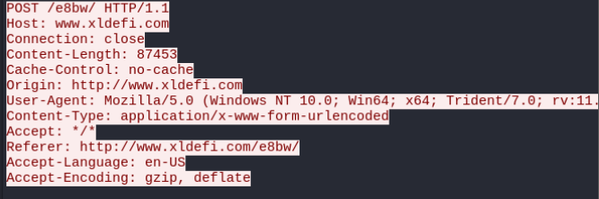

Tiếp tục là follow tcp 1 HTTP POST và sau gói đó là gói 200 OK với filter `(http.request or http.response or tls.handshake.type eq 1) and !(ssdp)`, gửi rất nhiều domain nhưng chỉ 1 số domain C2 hoạt động, kéo xuống dươi sẽ thấy 1 số domain cố gắng kết nối với mã độc nhưng không được phân giải
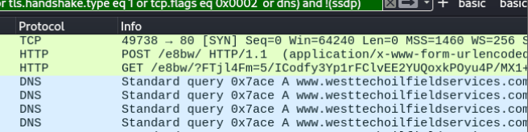

Ở silde có nêu ra các HTTP POST và REQUEST (giây 19:50)

## Malware -> Malicious HTTPS/SSL/TLS Traffic
### workshop-part-05-04.pcap
Phân tích traffice của malware drydex
Khi phân tích dùng filter `basic` thì thấy 1 số packet không bình thường, ví dụ như gửi HTTPS tới địa chỉ ip không liên kết với tên domain hay đến cổng 7443 là không phải cổng tiêu chuẩn cho https thay vì port 443
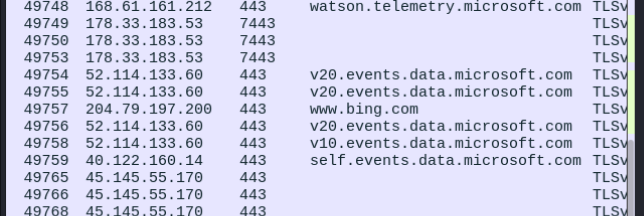

Xong lại có 1 kết nối HTTPS đến 1 domain lạ nên ta sẽ follow tcp vào
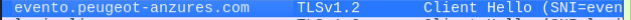

Tác giả phân tích đây có thể là 1 trang web hợp pháp do thấy `Lets encrypted` và tìm website trên google , check vào web `urlhaus.abuse.ch`
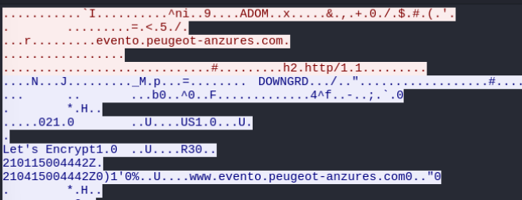

Báo cáo cho thấy web có liên quan đến malware Drydex 
[link](https://urlhaus.abuse.ch/url/1059145/)
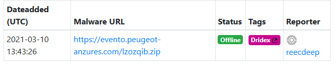

Tác giả đã có báo cáo
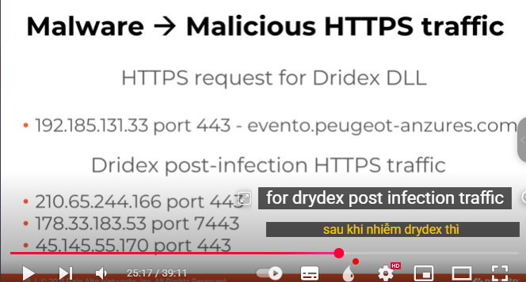

Trang web độc hại đã tự kí với chứng chỉ self-signed với 1 số strings lạ
Sử dụng filter kết hợp với 3 ip đã nói ở trong ảnh `tls.handshake.type eq 11 and (ip.addr eq 210.65.244.166 or ip.addr eq 178.33.183.53 or ip.addr eq 45.145.55.170)`
Sau đó phân tích theo đường dẫn như trong ảnh 
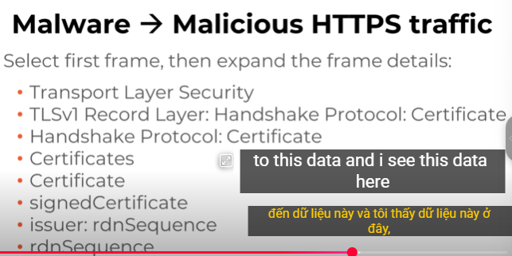

Theo như phân tích , malware sẽ điền thông tin của cert bằng các chuỗi strings random như trong ảnh, cả 3 ip đều như vậy:
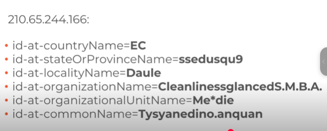

## Malware -> Malicious TCP Traffic
### workshop-part-05-05.pcap
Ví dụ về Remcos RAT post-infection traffic, filter ở trong ảnh
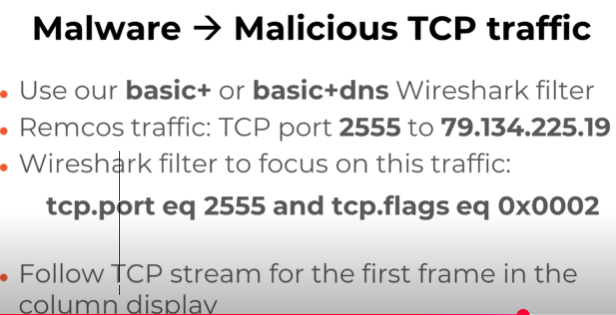

Đây là tcp post-traffic của RAT ở gói Frame đầu tiên, ta có thể thấy thông tin của file raw này về thông tin của máy window , link đến exe của RAT, filter `tcp.port eq 2555 and tcp.flags eq 0x0002`
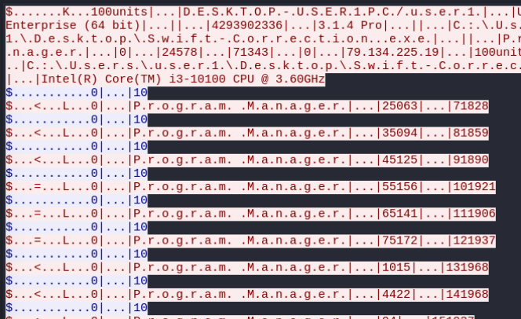

Ở gói frame thứ 2, follow tcp, ta thấy có thể liên quan đến ảnh jpeg, biến thành raw data rồi save as test.bin

Ở gói frame thứ 3,  follow tcp, kéo xuống cuối sẽ thấy username và password của 1 gmail 
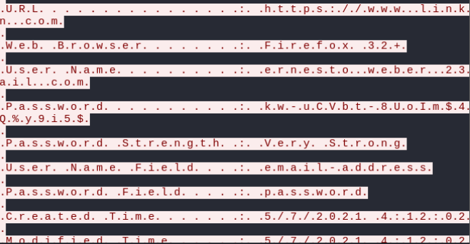

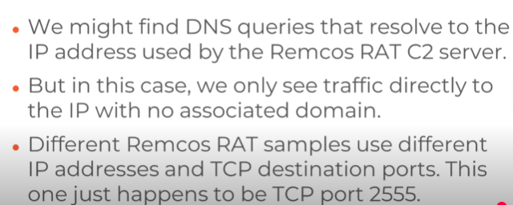
Có thể là bất cứ port nào ngoài 2555, các mẫu sample khác nhau sử dụng ip và port dst khác nhau, malware này không phân giải các truy vấn DNS -> ip mà trỏ thẳng đến ip, làm cho khó phân tích hơn malware lần trước. tác giả không nói gì thêm

Kết thúc! thanks for reading.