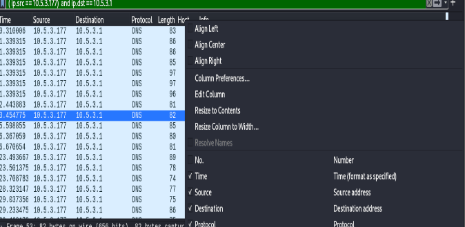

# 0.Cài đặt môi trường Wireshark
> Đây là lần đầu mình viết blog nên sẽ không được hay, mong mọi người thông cảm!.  

Thì không có gì là khó cả, mọi thứ cài đặt mình sẽ không nói ở đây. Cái mình muốn nói là có 1 số setup có thể có hữu dụng trong tương lai

## Thêm bớt các comlunm
1. Chuột phải vào các colunm sẵn có, chọn `Column preference...` 

2. Ở đây ta có thể thêm `+` , xóa `-` ,sửa các cột để được như ý muốn, hoặc sắp xếp các cột theo thứ tự khác nhau 
    - Cột `Type` có thể sửa , và cột `Filed` cũng vậy 
    
3. Tiếp theo là `Web Filter`, bạn có thể lọc các gói tin theo tiêu chí mình mong muốn.

.png)

[Link video gốc:https://youtu.be/xYzBFZDm6Ds](https://youtu.be/xYzBFZDm6Ds)

